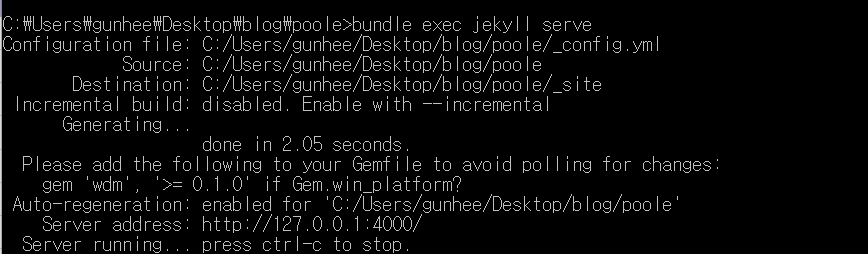
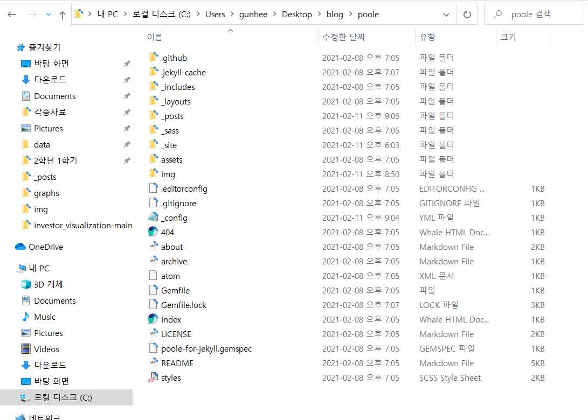
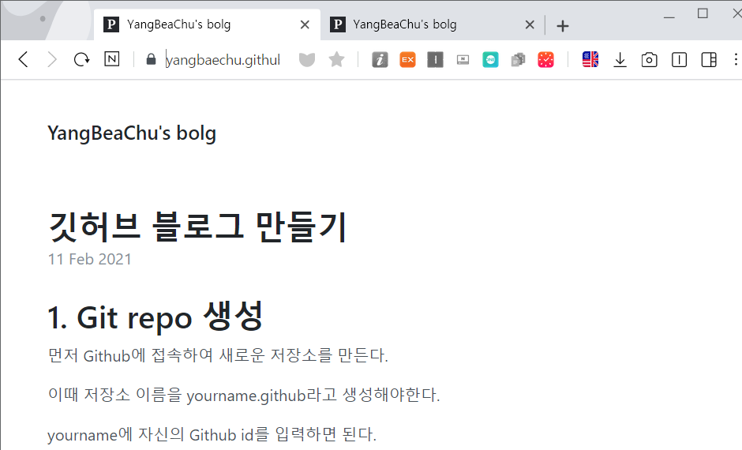

개발자 블로그를 시작하기로 마음을 먹으면서 큰 고민 없이 개발자 커리어에 도움이 될 수 있다는 Github 블로그를 하기로 선택했다.  하지만 아직 Github에도 익숙하지 않은 상태에서 Github 블로그를 시작하는 일은 생각보다 어려웠다.  그래서 정리도 해놓을겸 블로그의 첫번째 글로 Github 블로그를 만드는 법에 대해서 쓰기로 했다.

github 블로그는 다른 블로그에 비해서 진입장벽이 높다.

댓글 기능, 카테고리 기능도 기본적으로 지원되지 않아서 본인이 직접 추가해야한다.

하지만 그런 진입 장벽에도 불구하고 github와 호환된다는 장점 덕분에 많은 사람들이 활용하고 있다.

# 1. Git repo 생성

먼저 Github에 접속하여 새로운 저장소를 만든다.

이때 저장소 이름을 `[자신의 github id].github.io`라고 생성해야한다.

yourname에 자신의 Github id를 입력하면 된다.

이렇게 저장소를 만들고 브라우저에 방금 생성한 repository 이름(본인아이디.github.io)를 입력하면 블로그가 생성된 것을 확인할 수 있다.

# 2. 테마 고르기

github 블로그는 Github pages라는 서비스를 이용해서 만들 수 있다.

깃허브 페이지를 관리하는데 주로 사용되는 도구는 jekyll라는 도구로, ruby 언어로 된 정적 사이트 생성기이다.  아래 사이트에 들어가면 jekyll로 만들 수 있는 다양한 종류의 테마를 확인할 수 있다.

[jekyll 테마](http://jekyllthemes.org/)

아래 주소에서는 깃허브에서 인기있는 테마들을 확인할 수 있다.

[깃허브에서 인기있는 jekyll 테마 목록](https://github.com/topics/jekyll-theme)

원하는 테마를 선택해서 다운로드 하면 된다. 

# 3. ruby와 jekyll 설치

jekyll 테마를 로컬에서 관리하기 위해서는 먼저 ruby 개발환경을 세팅해 주어야 한다.

윈도우 환경에서는 아래의 링크에서 ruby installer를 다운로드 받으면 된다.

[ruby installer download](https://rubyinstaller.org/downloads/)

Ruby+Devkit 2.7.2-1 (x86) 버전을 받았다.

루비 설치가 완료되었다면 터미널에서 `ruby -v` 명령어를 입력하여 루비 설치가 잘 되었는지 확인해본다.

루비 설치가 완료되었다면 윈도우 검색창에서 ruby를 검색한 후  Start Command Prompt with Ruby를 실행한다.

ruby cmd를 실행했으면 다음 명령을 통해 jekyll와 bundler를 설치한다.


gem install jekyll bundler


# 4. jekyll 로컬 서버 실행하기

ruby cmd창에서 cd 명령어를 통해 위에서 jekyll 테마 파일을 다운로드 받은 경로로 이동해서 각종 플러그인을 설치한다.


cd [테마 파일이 저장된 위치]

bundle install



오류메세지 없이 설치가 완료되었다면 다음 명령어로 jekyll 로컬 서버를 구동하면 된다.



bundle exec jekyll serve



정상적으로 서버가 작동한다면 다음과 같은 메세지를 볼 수 있다.

`http://127.0.0.1:4000` 이 주소를 브라우저에 입력해서 자신이 선택한 블로그 테마가 잘 적용되었는지 확인할 수 있다.

# 5. _config.yml 수정하기

처음에 받아온 jekyll 테마 폴더에 _config.yml이라는 파일이 있다.

이 파일을 수정해서 블로그 제목, 로고 등을 사용자가 직접 커스터마이징 할 수 있다.

테마마다 조금씩 수정 가능한 범위가 다르고 완전한 커스터마이징을 위해서는 jekyll 테마의 다른 부분을 수정해야 할 수도 있다. 따라서 다음 링크를 참고하면 더 구체적인 설정이 가능할 것이다.

[jekyll 테마의 디렉토리 구조](http://jekyllrb-ko.github.io/docs/structure/)

# 6. github에 업로드하기

이제 남은 것은 이렇게 만든 블로그를 처음에 github에 만든 저장소에 올리는 일만 남았다.

- jekyll 테마가 있는 폴더에서 `git init` 명령을 실행해 로컬에 git 저장소를 만든다.
- `git add *` 명령어를 사용해서 폴더에 있는 모든 파일을 스테이지에 올려준다.
- `git coomt -m "커밋 메세지"`  명령으로 커밋을 진행한다.
- `git remote add origin[처음에 만든 저장소 주소]` 명령어를 이용해서 로컬 저장소와 원격 저장소를 연결한다. 
- 마지막으로 `git push origin master` 명령을 이용해 원격 저장소에 모든 파일을 확인한다.

이 과정을 마치면 다음과 같이 성공적으로 자신의 블로그를 확인할 수 있다.

만들어진 블로그의 글을 쓰는 마크다운(.md) 에디터로는 typora를 사용했다. 아래 링크를 눌러 홈페이지에 들어가서 스크롤을 내리면 typora를 다운로드 할 수 있다.

[typora 홈페이지]()

## 마치며..

 깃허브 블로그를 만들면서 고생도 많이 했지만 Github의 add -> commit -> push 일련의 과정에 좀 더 익숙해진것 같다. 여러 고생끝에 개인 블로그를 만든만큼 글도 꾸준히 올리고 장기적으로 댓글기능이나 태그 기능들도 추가해서 좀 더 완전한 모습의 블로그도 만들어보고 싶다!

