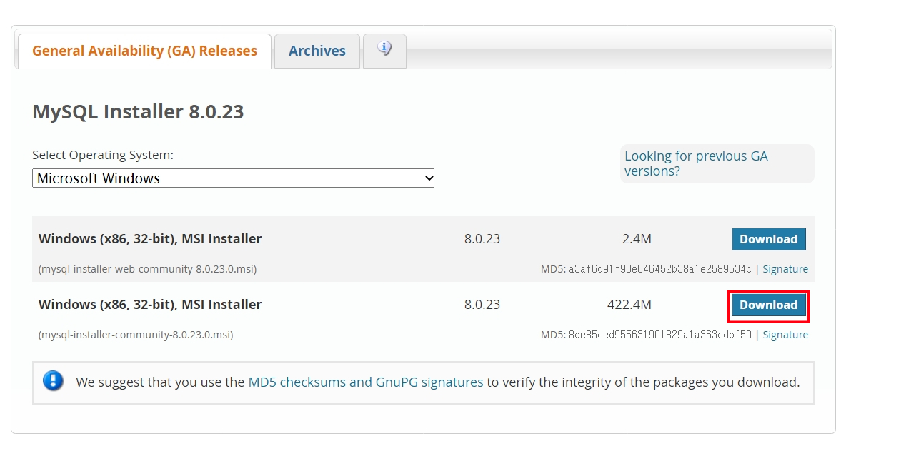
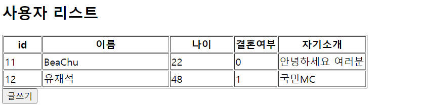

##  1. MySQL

### MySQL 설치

[MySQL 다운로드](https://dev.mysql.com/downloads/windows/installer/8.0.html)

윈도우 사용자의 경우는 위 링크로 들어가 아래와 같은 화면이 나오면 아래에 있는 다운로드 링크를 클릭하면 된다.



설치가 완료되면 mysql이 설치된 경로(보통 `C:\Program Files\MySQL\MySQL Server 8.0\bin` 이 경로에 설치된다.)로 이동한다. 그리고 `mysql -h localhost -u root -p`  라는 명령어를 실행하고 비밀번호를 입력한다. 콘솔창에 `mysql>` 이라고 출력되면 성공적으로 MySQL에 접속된 것이다. 


### 스키마(데이터베이스) 생성

먼저 다음의  쿼리를 mysql에 입력하여 앞으로 사용할 스키마를 만들고 해당 스키마를 사용하겠다는 것을 알려준다.

```
CREATE SCHEMA `nodejs` DEFAULT CHARACTER SET utf8;

use nodejs;
```


### 테이블 생성

다음으로 다음 쿼리를 입력하여 테이블을 생성한다.

```
CREATE TABLE nodejs.users (
id INT NOT NULL AUTO_INCREMENT,
name VARCHAR(20) NOT NULL,
age INT UNSIGNED NOT NULL,
married TINYINT NOT NULL,
comment TEXT NULL,
created_at DATETIME NOT NULL DEFAULT now(),
PRIMARY KEY(id),
UNIQUE INDEX name_UNIQUE (name ASC))
COMMENT = '사용자 정보'
DEFAULT CHARACTER SET = utf8
ENGINE = InnoDB;
```

테이블이 정상적으로 생성되면 
`Query OK, 0 row affected (0.09 sec)` 와 같은 메세지가 출력된다.


###  데이터 삽입

이제 만들어진 테이블에 데이터를 삽입한다.

INSERT INTO nodejs.users (name, age, married, comment) VALUES ('baechu', 22, 0, '나는 배추');



## 2. Node.js


### config/database.js

이제 새로운 프로젝트의 config 폴더 아래 database와 노드를 연결해줄 databases.js  파일을 만든다.

```javascript
var mysql = require('mysql');
var db_info = {
    host: 'localhost',
    port: '3306',
    user: 'user_name',
    password: 'password',
    database: 'db_name'
}

module.exports = {
    init: function () {
        return mysql.createConnection(db_info);
    },
    connect: function(conn) {
        conn.connect(function(err) {
            if(err) console.error('mysql connection error : ' + err);
            else console.log('mysql is connected successfully!');
        });
    }
}
```

위 모듈은 DB와 서버의 연결 객체를 반환하는 init() 함수와 실제 데이터 교환을 위해 연결을 시키는 connect() 함수로 구성되어 있다.

init()함수에서 DB연결을 진행할 때 db_info라는 변수로 DB에 대한 정보를 매개변수로 넘겨준다.

- port: DB를 설치할 때 사용자가 지정한 포트번호, 따로 지정하지 않았다면 기본값은 3306이다.
- user:  MySQL에 접속할 때 사용하는 DB의 유저 이름, 내 경우에는 root이다.


### index.js

```javascript
var express = require('express');
var app = express();
var db_config = require(__dirname + '/config/database.js');
var conn = db_config.init();
var bodyParser = require('body-parser');

db_config.connect(conn);

app.set('views', __dirname + '/views');
app.set('view engine', 'ejs');

app.use(bodyParser.json());
app.use(bodyParser.urlencoded({extended : false}));

app.get('/', function (req, res) {
  res.send('ROOT');
});


/* DB 읽어오기 */
app.get('/list', function (req, res) {
  var sql = 'SELECT * FROM users';  
  conn.query(sql, function (err, rows, fields) {
​    if(err) console.log('query is not excuted. select fail...\n' + err);
​    else res.render('list.ejs', {list : rows});
​    console.log(rows)
  });
});

/* DB 쓰기 */
app.get('/write', function (req, res) {
  res.render('write.ejs');
});

app.post('/writeAf', function (req, res) {
  var body = req.body;
  console.log(body);

  var sql = 'INSERT INTO users (name, age, married, comment, created_at) VALUES(?, ?, ?, ?, NOW())';
  var params = [body.name, body.age, body.married, body.comment];
  console.log(sql);
  conn.query(sql, params, function(err) {
​    if(err) console.log('query is not excuted. insert fail...\n' + err);
​    else res.redirect('/list');
  });
});

app.listen(3000, () => console.log('Server is running on port 3000...'));
```


위에서 만든 모듈 config/database.js를 이용해서 DB에서 읽기/쓰기 작업을 하는 코드이다.

- 위 모듈의 init() 함수에서 반환된 DB와의 연결객체를 conn이라는 변수에 저장했다.
- conn.query(sql, params, callback)메소드를 이용해 쿼리를 실행한다.


이제 ejs를 이용해서 클라이언트 코드를 작성하면 다음과 같다.

### views/list.ejs

```ejs
<html>
    <head>
        <meta charset="utf-8">
        <title>사용자 리스트</title>
    </head>
    <body>
        <h2>사용자 리스트</h2>
        <table border='1'>
            <colgroup>
                <col width='60'><col width='200'><col width='100'>
            </colgroup>
            <thead>
                <tr>
                    <th>id</th>
                    <th>이름</th>
                    <th>나이</th>
                    <th>결혼여부</th>
                    <th>자기소개</th>
                </tr>
            </thead>
            <tbody>
                <% for(i = 0; i < list.length; i++) { %>
                <tr>
                    <td><%=list[i].id %></td>
                    <td><%=list[i].name %></td>
                    <td><%=list[i].age %></td>
                    <td><%=list[i].married %></td>
                    <td><%=list[i].comment %></td>
                </tr>
                <% } %>
            </tbody>
        </table boader='1'>
        
        <button onclick="location.href='../write'">글쓰기</button>
    </body>
</html>
```


### write.ejs

```ejs
<html>
    <head>
        <meta charset="utf-8">
        <title>사용자 정보 입력</title>
    </head>
    <body>
        <h2>사용자 정보</h2>
        <form action='/writeAf' method='post'>
            이름 : <input type='text' name='name'><br>
            나이 : <input type='number' name='age'><br>
            결혼여부 : <input type='number' name='married'><br>
            자기소개 : <textarea name='comment'></textarea><br>
            <button type='submit'>사용자 추가</button>
        </form>
    </body>
</html>
```

위 과정을 성공적으로 마치고 http://localhost:3000/write에서 사용자의 정보를 등록하고나면 다음과 같이 사용자 정보가 업로드 되어 있는 것을 확인할 수 있다.



